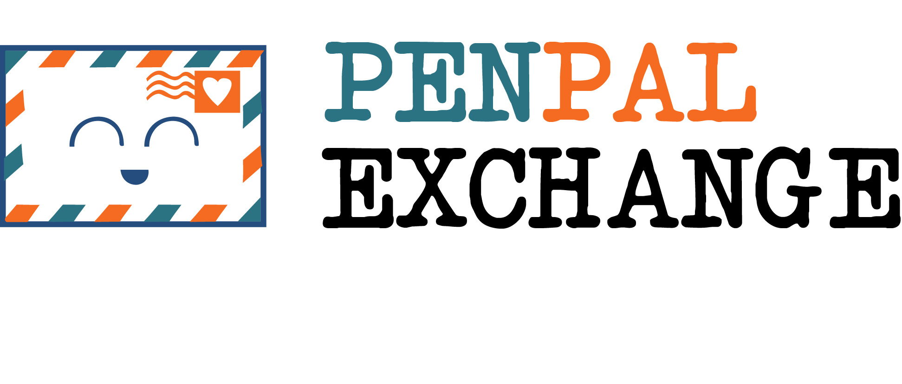

# PenPal Exchange Kikbot

PenPal allows students to find other students at their school who are at a similar age, with similar hobbies. PenPal is built using the Microsoft Bot Framework and is active on Kik as `/penpal01`. 

## Links
- [Youtube](https://www.youtube.com/watch?v=A3YdHEDHupA)
- [DevPost](http://devpost.com/software/penpal-exchange)

## Frameworks and APIs
Penpal uses the following:

- [Microsoft Bot Framework](https://docs.botframework.com/en-us/)
	- Microsoft Bot Framework is the 'middleman' that connects penpal to Kik. 
	- Through the framework, it is easy to configure penpal to work with the following services: Skype, email, Facebook messenger, GroupMe, Slack, Telegram, Twilio (SMS). You would only need to click through a few pages to set up authentication of dev API ids and keys on each different service you want to set up.

## Setup
- Getting data
	- Generate data [online](https://mockaroo.com/c2431200) or connect to your own database.
	
Run `setup.sh` in bash or go through the following steps:
- API keys
	- Insert your Microsoft BotFramework API keys in `app.js`, by replacing  the strings `'APP_ID'` and `'APP_PASSWORD'`. 

- Node
	- navigate to `src` and run the following commands in the command line:
		- `npm install` to install npm dependencies
		- `node app.js` to run the application on your computer

## Testing
The easiest way to test is using Microsoft's [Bot Framework Emulator](https://docs.botframework.com/en-us/tools/bot-framework-emulator/).
It will allow you to test offline without having to get API keys or set up a server in the cloud.

During testing, everytime you update the code, you will need to stop the running `node app.js` process and run it again so it will use the new code, *and* also close and restart the Bot Framework Emulator, so that it will clear up any saved information, eg. the saved `Profile` information. This is a result of the way the Bot Framework Emulator works, and is not caused by penpal.

## Images

*Subscribing to penpal01 on kik.*
  

*Completing profile and recommended a penpal by penpal01 on kik.*
  
